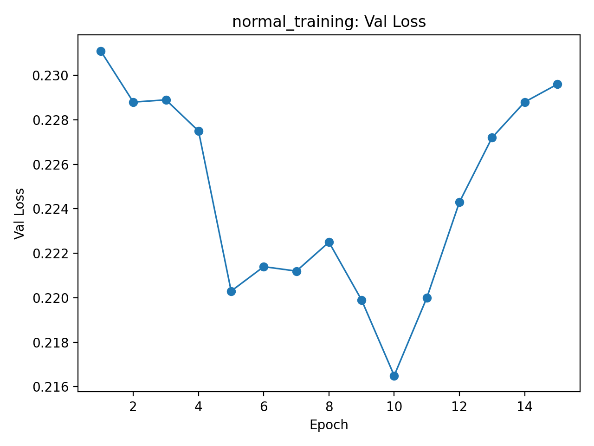
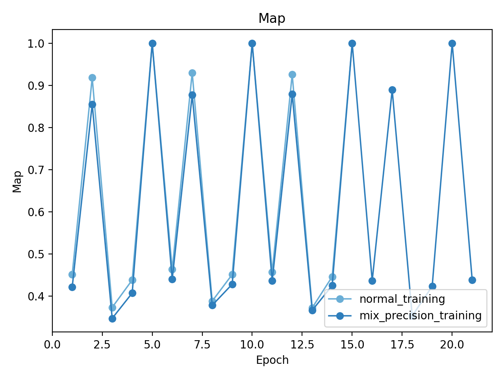

# Selected Topics in Visual Recognition using Deep Learning HW 2

- **Name**: 馬楷翔
- **Student ID**: 110550074

## 1 Introduction
Hand‑written multi‑digit recognition is a two‑stage problem:

1. **Detection** – locate every digit (bounding boxes).  
2. **Classification** – predict each digit class (1‑10, background).

Because digits can overlap, vary in scale and aspect ratio, a region‑proposal detector is appropriate.  
We adopt **Faster R‑CNN with a ResNet‑50‑FPN** backbone, whose two‑stage design (RPN plus ROI head) copes well with small objects.

Key elements of our implementation:

* Directly use the well‑maintained torchvision model.  
* Strict inference reproducibity via `seeds.py` (using deterministic algorithm).
* Minimal data pipeline (`to_tensor` only) – torchvision’s internal transform handles resizing/normalisation.  
* Two training variants: full precision (`trainer.py`) and mixed precision (`mixed_trainer.py`) for speed exploration.

## 2 Method

### 2.1 Data pre‑processing

| Step          | Details                                                                                                                      |
| ------------- | ---------------------------------------------------------------------------------------------------------------------------- |
| Input format  | PNG images plus COCO‑style JSON (`train.json`, `valid.json`, `test.json`).                                                   |
| Dataset class | `CocoDetectionDataset` (see code).                                                                                           |
| Transform     | `torchvision.transforms.functional.to_tensor`. All further transform is done by `GeneralizedRCNNTransform` inside the model. |
| Batching      | Custom collate function returns `(images, targets)` in the format expected by torchvision.                                   |

### 2.2 Network architecture

```
Input  →  ResNet‑50 (C2–C5)  →  FPN  →  RPN  →  ROIAlign  →  2‑FC head
                                                ├─ classification (11 classes)
                                                └─ bounding‑box regression
```

* **Backbone** ResNet‑50 up to C5, stride 32.  
* **Neck** Feature Pyramid Network (P2–P6).  
* **RPN** 3 anchors per location; objectness and box‑delta branches.  
* **ROI head** ROIAlign → 2 fully connected layers (1024 units) → classification and regression outputs.

Losses follow the original Faster R‑CNN paper: RPN classification + regression, and ROI classification + regression (Smooth‑L1).

### 2.3 Hyper‑parameters

| Parameter    | FP32 run                     | Mixed‑precision run |
| ------------ | ---------------------------- | ------------------- |
| Batch size   | 16                           | 24                  |
| Epochs       | 30                           | 15                  |
| Optimizer    | SGD, lr = 5e‑3, momentum 0.9 | same                |
| Weight decay | 5e‑4                         | same                |
| Scheduler    | StepLR(step = 10, γ = 0.1)   | same                |
| Seed         | 42                           | 42                  |

### 2.4 Training scripts

* `trainer.py`: full precision, validation loss decides the best model, resumes with `--pth-path`.  
* `mixed_trainer.py`: uses `torch.cuda.amp`, validation accuracy decides the best model.

Both scripts save a checkpoint each epoch and always update `best_model.pth` when the monitored metric improves.

## 3 Results

### 3.1 Main experiment (FP32, **best‑loss model = epoch 10**)

| Metric (validation set)           | Value     |
| --------------------------------- | --------- |
| mAP (0.5 : 0.95)                  | **0.449** |
| AP@0.50                           | 0.922     |
| Accuracy (precision at IoU ≥ 0.5) | 0.541     |
| Best epoch                        | 10 / 30   |

#### Training curves  

| Loss                                      | mAP                                  |
| ----------------------------------------- | ------------------------------------ |
|  |  |

### 3.2 Additional experiment – mixed precision

| Item                          | FP32      | Mixed precision |
| ----------------------------- | --------- | --------------- |
| Epochs (run)                  | 30        | 30              |
| Typical wall‑time / epoch     | 22 min    | **15 min**      |
| Maximum batch size (8 GB GPU) | 16        | **24**          |
| **Best mAP (0.5 : 0.95)**     | **0.457** | 0.441           |
| Best validation accuracy      | 0.526     | **0.908**       |

#### Comparative curves  

| Accuracy                         | mAP                         |
| -------------------------------- | --------------------------- |
|  |  |

*Automatic mixed precision (AMP) shortens each epoch by ≈ 32 % and accommodates a **1.5× larger batch size**.  
However, its best mAP lags the FP32 run by ≈ 1.6 percentage points, and the validation curves become noticeably noisier after epoch 15.*

## 4 Choice of architecture

**Pros**

* Strong accuracy on small and medium objects.  
* Modular two‑stage design enables fine‑grained control.  
* Available in torchvision; minimal implementation effort.

**Cons**

* Slower inference than one‑stage detectors (e.g. YOLO, RetinaNet).  
* Memory heavier due to per‑proposal operations.

Given the assignment priority on accuracy rather than real‑time speed, Faster R‑CNN is a reasonable trade‑off.

## 5 Conclusion
A straightforward ResNet‑50‑FPN Faster R‑CNN baseline, trained with SGD and a StepLR schedule, achieves **45.7 % COCO mAP** on the validation split.  
Mixed precision reduces training time by roughly one‑third but delivered slightly lower accuracy in our setup. Future work includes anchor‑free detectors and richer data augmentation.


### Appendix

- Github Link: https://github.com/seanmamasde/Selected-Topics-in-Visual-Recognition-using-Deep-Learning
- The model download link can be found on the main `README.md` page of the repository.
